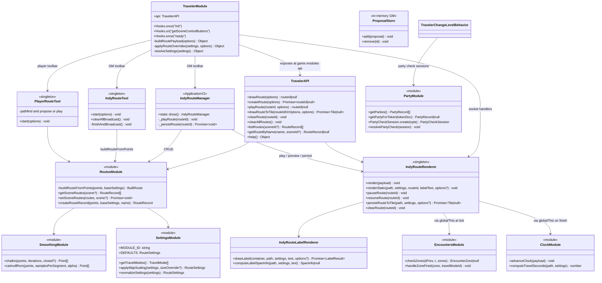
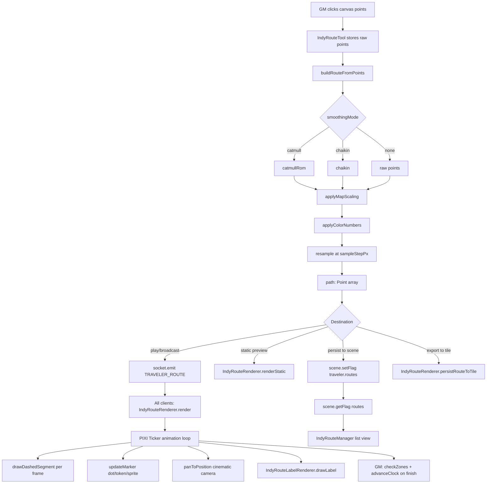
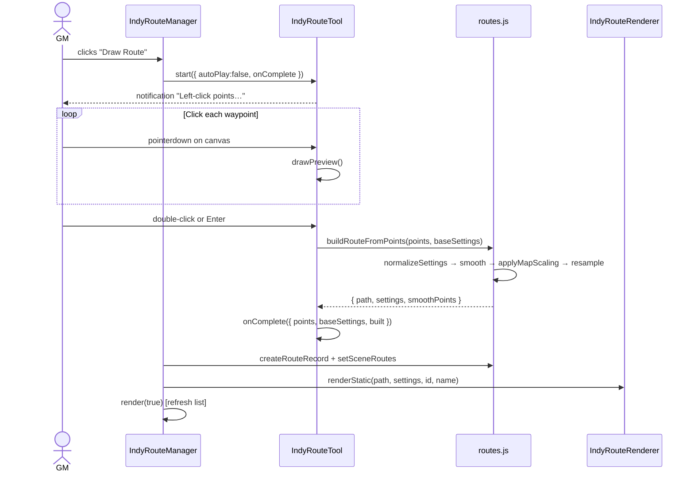
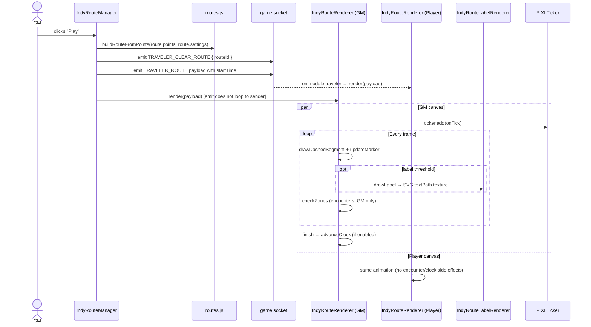
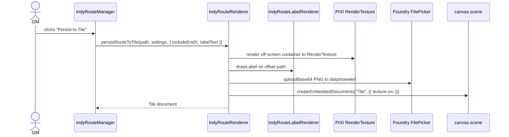
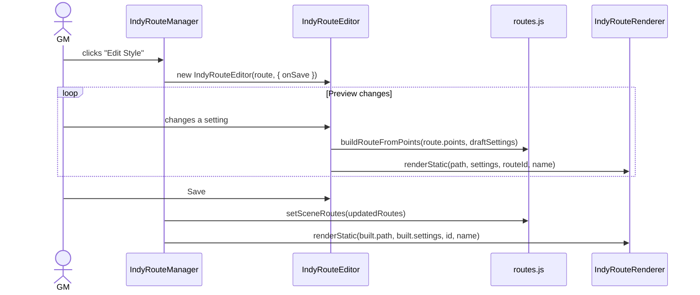
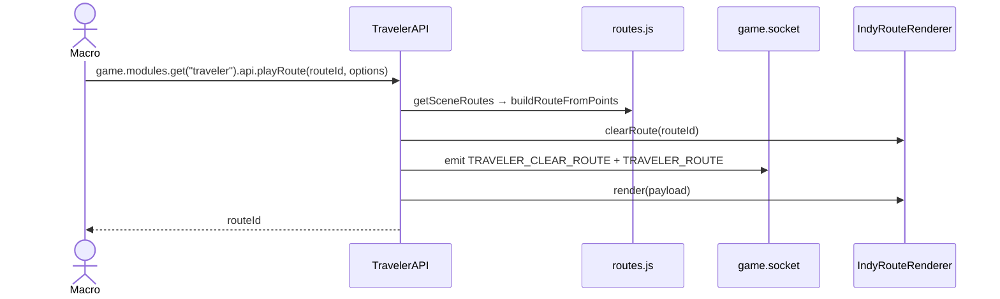
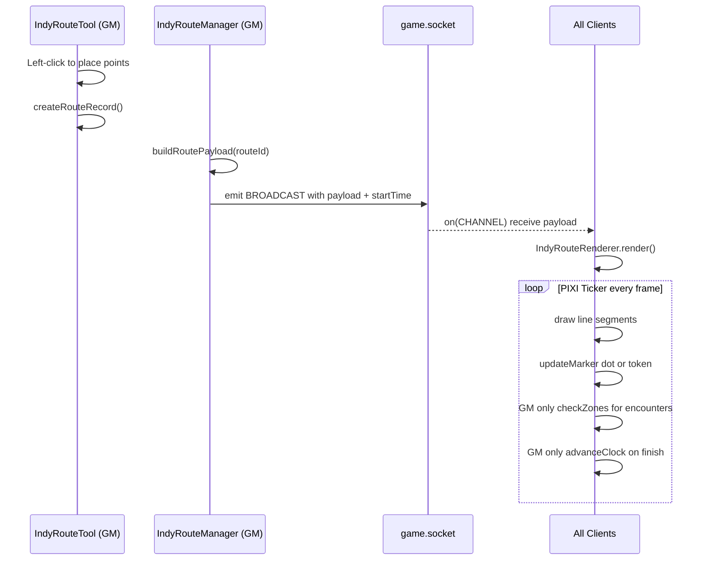
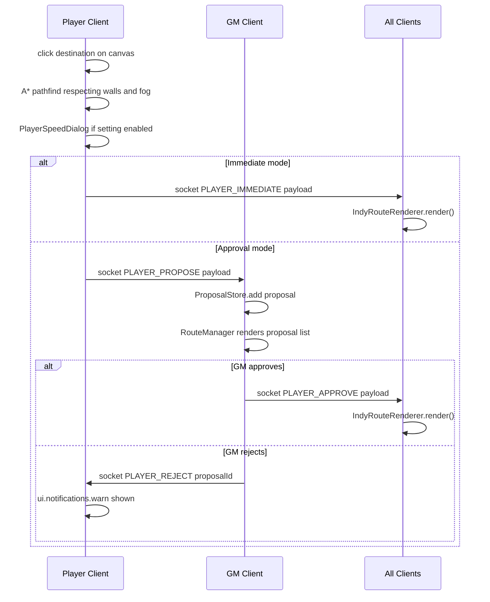
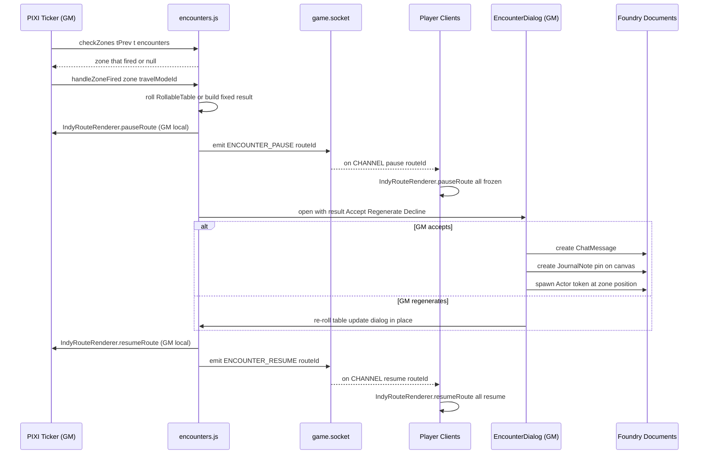

# Traveler — Developer Documentation

> For user-facing documentation see [README.md](README.md).

---

## Table of Contents

- [Overview](#overview)
- [Functional Areas](#functional-areas)
- [Repository Structure](#repository-structure)
- [Architecture Overview](#architecture-overview)
  - [Component Model](#component-model)
  - [Route Pipeline](#route-pipeline)
  - [Sequence Diagrams](#sequence-diagrams)
- [Key Design Decisions](#key-design-decisions)
- [Module Entry Point & Lifecycle](#module-entry-point--lifecycle)
- [Data Model](#data-model)
- [Socket Communication](#socket-communication)
- [Testing](#testing)
  - [Unit Tests (Vitest)](#unit-tests-vitest)
  - [Integration Tests (Quench + Docker)](#integration-tests-quench--docker)
  - [Test Fixtures](#test-fixtures)
- [Local CI Setup](#local-ci-setup)
- [Remote CI (GitHub Actions)](#remote-ci-github-actions)
- [Changelog Convention](#changelog-convention)

---

## Overview

**Traveler** (`traveler`) is a Foundry VTT module (v13/v14) that lets a GM draw, save, animate, and share travel routes on the canvas. Routes use smooth dashed lines with animated dot or token movement, optional cinematic camera panning, path-following labels, sound playback, and travel-time/cost tooltips from configurable travel modes. Animation is synchronised across every connected client via Foundry's socket system.

Beyond core route playback, Traveler adds player A* pathfinding (with optional GM approval), encounter zones along routes, world-clock advancement, party-based level-change checks, and region behaviors for elevation changes. The module is **system-agnostic** — no game-system API imports.

There is **no build step** for day-to-day development: Foundry loads plain ES modules directly. An optional `npm run traveler:package` script produces a distributable zip under `dist/` (see [README.md](README.md)); that staging step strips the Quench test harness from the packaged copy only.

---

## Functional Areas

| Area | Description |
|------|-------------|
| **Route Drawing** | GM clicks canvas waypoints; `IndyRouteTool` draws a live preview and saves the finished route to scene flags. |
| **Smoothing** | Raw points are smoothed with Catmull-Rom (default) or Chaikin, then resampled at `sampleStepPx` to produce the runtime `path` array. |
| **Rendering** | Animated dashed lines, moving dot/token sprite, cinematic pan/zoom, end-of-route X marker, and fade-in label — all via PIXI on `canvas.primary` or `canvas.effects`. |
| **Label Rendering** | SVG `<textPath>` with fonts inlined as base64 data-URIs so curved text renders correctly as a PIXI texture. |
| **Persistence** | Routes stored on the Scene document: `scene.setFlag("traveler", "routes", [...])`. Raw click-points (not the smoothed path) are persisted so routes can be re-smoothed later. |
| **Multiplayer Sync** | Socket messages on `module.traveler` (`TRAVELER_ROUTE`, `TRAVELER_CLEAR_ROUTE`, `TRAVELER_CLEAR`, plus player/encounter/party types) propagate render, clear, pause, and check events. |
| **Tile Export** | Off-screen PIXI `RenderTexture` → PNG → FilePicker upload → locked Tile overlay on the scene. |
| **Route Manager UI** | ApplicationV2 panel: drag-to-reorder, play, preview, edit points/style, persist-to-tile, clear, delete, JSON import/export. |
| **Settings UIs** | Global defaults, per-route style editor, travel mode CRUD, currency conversion CRUD, party config, scene distance override. |
| **Travel Calculations** | Tooltips compute distance (pixels → scene units), travel time, and fare cost as multi-denomination currency strings. |
| **Player Pathfinding** | Players click a destination; grid A* respects walls and fog-of-war; immediate or GM-approval playback modes. |
| **Encounters** | Explicit, auto-interval, or fixed encounter zones along a route; table rolls, pause/resume sync, token/note/chat on accept. |
| **World Clock** | Optional `game.time` advancement when a route finishes, using travel mode speed and per-scene distance override. |
| **Party System** | Party tokens trigger distributed level-check rolls to each member; GM sees live status in `PartyCheckCollector`. |
| **Region Behaviors** | `traveler.changeLevel` RegionBehaviorType for automatic or roll-gated elevation changes. |
| **Public API** | `game.modules.get("traveler").api` exposes `drawRoute`, `createRoute`, `playRoute`, `drawRouteToTile`, `clearRoute`, `clearAllRoutes`, `listRoutes`, `getRouteByName`, `help`. |

---

## Repository Structure

```
traveler/
├── module.json                   Foundry VTT manifest
├── scripts/
│   ├── traveler.js               Module entry point — hooks, settings, sockets
│   ├── settings.js               DEFAULTS, travel modes, helpers
│   ├── constants.js              MODULE_ID, CHANNEL, MSG socket type strings
│   ├── routes.js                 Route record CRUD + buildRouteFromPoints()
│   ├── renderer.js               PIXI animation engine (IndyRouteRenderer)
│   ├── tool.js                   GM canvas drawing tool (IndyRouteTool)
│   ├── tool-player.js            Player A* pathfinding tool + proposal submit
│   ├── proposals.js              Ephemeral in-memory GM proposal store
│   ├── encounters.js             Encounter zone logic, table rolling, resolution
│   ├── clock.js                  World clock advance (computeTravelSeconds etc.)
│   ├── party.js                  Party CRUD, lookups, PartyCheckSession store
│   ├── smoothing.js              Catmull-Rom and Chaikin smoothing algorithms
│   ├── label-renderer.js         Route label rendering (path-following text)
│   ├── package-traveler.js       Build dist/traveler.zip (strips Quench from staged copy)
│   ├── ci-bootstrap.js           Docker exec: verify dnd5e/Quench, join CI world
│   ├── write-ci-env.js           Write .env for CI from GitHub secrets
│   ├── run-quench.js             Playwright driver for Quench batches
│   ├── foundry-playwright.js     Browser login + canvas readiness helpers
│   ├── foundry-wait.js           Poll /api/status until Foundry is ready
│   ├── world-clean.js            Reset tests/world/ to pristine state
│   ├── load-env.js               Shared .env loader for Node scripts
│   ├── apps/
│   │   ├── manager.js            IndyRouteManager ApplicationV2 (Route Manager window)
│   │   ├── settings-app.js       IndyRouteSettingsBase / IndyRouteEditor
│   │   ├── encounter-dialog.js   EncounterDialog — GM Accept/Regen/Decline
│   │   ├── player-speed-dialog.js PlayerSpeedDialog — speed picker before proposal
│   │   ├── scene-settings.js     SceneSettingsDialog — distance override
│   │   ├── party-config.js       PartyConfigApp — manage party groups
│   │   ├── party-check-collector.js  PartyCheckCollector — GM live roll display
│   │   ├── travel-modes.js       IndyRouteTravelModesApp — travel mode list editor
│   │   └── currencies.js         IndyRouteCurrenciesApp — currency conversion editor
│   ├── behaviors/
│   │   ├── change-level.js       TravelerChangeLevelBehavior (RegionBehaviorType)
│   │   └── level-check-dialog.js TravelerLevelCheckDialog — individual & party check dialog
│   └── pathfinding/
│       ├── astar.js              Grid A* with binary min-heap priority queue
│       └── fog-checker.js        Fog-of-war / vision cell check helpers
├── templates/
│   ├── route-manager.hbs
│   ├── settings.hbs              Includes Encounters tab (partial: encounter-editor.hbs)
│   ├── encounter-dialog.hbs
│   ├── encounter-editor.hbs      Zone list/editor partial (embedded in settings.hbs)
│   └── …                         party, scene-settings, level-check, etc.
├── tests/
│   ├── setup.js                  Vitest global Foundry mocks (canvas, game, PIXI…)
│   ├── unit/                     Vitest unit tests (no Foundry runtime required)
│   │   ├── astar.test.js
│   │   ├── change-level.test.js
│   │   ├── clock.test.js
│   │   ├── encounters.test.js
│   │   ├── fog-checker.test.js
│   │   ├── level-check-dialog.test.js
│   │   ├── party.test.js
│   │   ├── party-check-collector.test.js
│   │   ├── player-speed.test.js
│   │   ├── proposals.test.js
│   │   ├── routes.test.js
│   │   ├── settings.test.js
│   │   └── smoothing.test.js
│   ├── quench/                   Quench integration tests (run inside live Foundry)
│   │   ├── index.js              Registers all batches
│   │   ├── fixtures.js           SceneFixture + WallFixture — programmatic world data
│   │   ├── pathfinding.quench.js
│   │   ├── region-behavior.quench.js
│   │   ├── player-route.quench.js
│   │   ├── party.quench.js
│   │   ├── encounters.quench.js
│   │   └── clock.quench.js
│   └── world/
│       └── world.json            Minimal world manifest for Docker CI
├── docs/
│   ├── encounters.plan.md
│   ├── party.plan.md
│   ├── player-pathfinding.plan.md
│   ├── region_change-level_behavior_aaf67ad6.plan.md
│   ├── testing.plan.md
│   └── travel-time.plan.md
├── docker/
│   ├── compose.test.yml          Docker Compose for local/CI integration testing
│   └── patches/                  Container startup scripts (dnd5e, Quench, permissions)
├── .github/workflows/ci.yml      GitHub Actions workflow
├── vitest.config.js
├── package.json                  npm scripts: test, foundry:*, traveler:package
├── .env.example
├── DEVELOPER-README.md
└── CHANGELOG.md
```

---

## Architecture Overview

Core route code still uses the `IndyRoute*` class prefix from the module's original name; the Foundry module id is `traveler`. The diagrams below use current socket type strings and flag namespaces.

### Component Model



Encounter and clock helpers are attached on `globalThis` in `traveler.js` to avoid circular imports with `renderer.js` (see [Key Design Decisions](#key-design-decisions)).

### Route Pipeline



### Sequence Diagrams

#### GM draws and saves a route



#### Playing a saved route (multi-client)



#### Persist route to tile



#### Edit route style (live preview)



#### Public API — macro triggers a route



#### GM route playback (encounters & clock)



#### Player proposal flow



#### Encounter zone resolution



---

## Key Design Decisions

### Core route engine

| Decision | Rationale |
|----------|-----------|
| **Store raw click-points, not smoothed path** | Allows re-smoothing with different algorithms without data loss; map-scaling is re-applied at play-time so routes render correctly at any zoom. |
| **Socket emit does not loop back to sender** | Foundry's socket `emit` does not deliver to the originating client; `IndyRouteRenderer.render()` is called explicitly on the GM's client after every `emit`. |
| **`window.__travelerBroadcast` registry** | Tracks active PIXI containers across render calls without a module singleton that could be lost on hot-reload. |
| **SVG textPath for labels** | PIXI text cannot follow a curve. An SVG data-URI is rasterised to a texture; fonts are fetched and inlined so off-document SVG can access them. |
| **`lingerMs: -1` means persist forever** | Positive values schedule destroy after animation; `-1` keeps the route overlay on the canvas indefinitely. |
| **`scaleMapSize` snapshot in `createRouteRecord`** | When `scaleWithMap` is enabled, current map pixel dimensions are saved so scaling can be reproduced identically at playback. |

### System-agnostic core

The module does not import any game-system API. All system-specific logic is:
- Delegated to the GM via Rollable Tables (encounters)
- Expressed as free-text formulas (`checkFormula: "1d20+3"`) evaluated via Foundry's Roll API
- Driven by item name patterns and status effect ids the GM configures per-region

This means the module works with D&D 5e, Pathfinder, Dragonbane, and any other system.

### Client-side rendering, socket-synced start time

Routes are not re-broadcast on every frame. The GM emits the full payload **once** with a
`startTime` timestamp. Every client independently runs the PIXI animation using `Date.now()`
relative to `startTime`. This keeps bandwidth minimal and animations in sync even with brief
packet delay.

### ESM throughout; no build step

All source files use native ES modules (`type: "module"` in `module.json`). Foundry v14 loads
them directly. There is no bundler or transpile step in the dev loop. Optional packaging to
`dist/traveler.zip` copies runtime files only and does not change repo source.

### Circular import avoidance via `globalThis`

`renderer.js` needs encounter and clock logic at tick time, but importing those modules would create
circular dependencies (`renderer ← encounters ← renderer`). The solution: `traveler.js` (the entry
point) performs the imports and attaches helpers to named `globalThis` objects:

```js
globalThis.__travelerEncounters = { checkZones, handleZoneFired, resetZoneTriggers };
globalThis.__travelerClock      = { advanceClock };
```

The renderer reads from these at runtime. This is intentional, documented, and tested.

### Encounter animation pause (all clients)

When an encounter zone fires, **all clients** pause simultaneously. The sequence is:

1. GM's renderer is paused locally (immediate, no round-trip delay).
2. GM emits `ENCOUNTER_PAUSE` via socket → all player clients freeze at the same point.
3. GM interacts with the EncounterDialog (accept / regenerate / decline).
4. GM's renderer resumes locally.
5. GM emits `ENCOUNTER_RESUME` → all player clients continue from where they stopped.

This means players see their token freeze mid-route, the GM resolves the encounter, and then
everyone resumes together. The NPC token and Note created on "accept" appear on all clients via
normal Foundry document creation.

### Party token — multi-user check protocol

When a **party token** (a single token representing the whole group) enters a level-change region,
the module disperses roll-check dialogs to every party member's client instead of showing one
dialog to whoever owns the token. The protocol:

1. GM's `_handleMoveIn` detects the party via `getPartyForToken(tokenDoc)`.
2. A `PartyCheckSession` is created (in-memory, GM client only) with one participant per member.
3. `PARTY_CHECK_REQUEST` is emitted via socket to each member's `userId`.
4. The GM sees a `PartyCheckCollector` dialog showing live roll statuses.
5. Each player receives the request, their `TravelerLevelCheckDialog` opens with `partySessionId`
   set — on submit the dialog emits `PARTY_CHECK_RESULT` back to the GM instead of resolving locally.
6. The GM's socket handler calls `session.addResult()` and calls `collector.refresh()`.
7. When all results are in (or GM clicks **Force Resolve**), `resolvePartyCheck()` is called.
8. Pass → `continueMovement` + elevation update; Fail → `stopMovement` + damage to each failed actor.
9. A chat message summarises every individual roll result.

### Per-scene distance override vs. Foundry grid

Foundry's `canvas.scene.grid.distance` is designed for combat (e.g. "5 ft per square"). Overland
maps need "100 miles per square". Rather than asking GMs to switch their grid, Traveler stores an
independent `sceneDistance` flag on the scene document. `getSceneDistanceConfig()` always prefers
the flag when present and falls back to the native grid otherwise.

### Player pathfinding — fog boundary anchor

Standard A* cannot pathfind through unexplored cells (the goal cell's fog state is unknown). When
the destination is in fog, the pathfinder returns the path to the last explored cell on the way.
A pulsing anchor indicator is drawn at that boundary. When the player's vision expands (e.g. the
party moves), the `sightRefresh` hook triggers a re-evaluation from the anchor toward the original
destination.

---

## Module Entry Point & Lifecycle

`scripts/traveler.js` runs in three Foundry hook phases:

| Hook | What happens |
|---|---|
| `init` | Register region behavior; register module settings; pre-load templates; expose encounter and clock helpers on `globalThis` |
| `getSceneControlButtons` | Add GM and player toolbar buttons |
| `ready` | Expose the public API (`game.modules.get("traveler").api`); register socket handlers; expose PlayerRouteTool globally; register Quench suites if Quench is active |

### Registered settings (world)

| Key | Type | Purpose |
|-----|------|---------|
| `routeSettings` | Object | Global default route visual/animation settings |
| `travelModes` | Array | Travel mode definitions (speed, cost) |
| `currencyConversions` | Array | Multi-denomination currency display |
| `parties` | Array | Party groups (token + members + resolution mode) |
| `ignoreCurrencies` | Boolean | Skip currency formatting in tooltips |
| `playerRouteMode` | String | `"immediate"` or `"approval"` for player pathfinding |
| `worldClockEnabled` | Boolean | Advance `game.time` when routes finish |
| `playerSpeedPrompt` | Boolean | Show speed picker before player route submit |

Scene-level flags (not settings): `traveler.routes`, `traveler.sceneDistance`.

---

## Data Model

### Route record (stored in scene flag `traveler.routes`)

```js
{
  id:         string,         // randomID()
  name:       string,
  points:     [{ x, y, elevation? }],  // raw GM-placed waypoints
  settings:   RouteSettings,  // visual + animation settings
  encounters: EncounterZone[],
  createdAt:  number,
  updatedAt:  number
}
```

### RouteSettings (key fields)

```js
{
  travelMode:    string,   // travel mode id or "none"
  levelId:       string,   // Scene Level document id
  defaultElevation: number,
  drawSpeed:     number,   // px/sec
  lineColor:     string,   // CSS hex
  cinematicMovement: boolean,
  // … many visual fields
}
```

### EncounterZone

```js
{
  id:          string,
  type:        "explicit" | "auto" | "fixed",
  t:           number,        // 0.0–1.0 along route (explicit/fixed)
  frequency:   number,        // 0.0–1.0 interval (auto)
  chance:      number,        // 0.0–1.0
  tableId:     string | null,
  tableName:   string,
  actorId:     string | null, // fixed type
  label:       string,
  environment: string,
  spawnToken:  boolean,
  createNote:  boolean,
  chatMessage: boolean,
  _triggered:  boolean        // runtime only, not persisted
}
```

### PlayerRouteProposal (in-memory only, ProposalStore)

```js
{
  id:              string,
  userId:          string,
  playerName:      string,
  tokenId:         string,
  tokenName:       string,
  sceneId:         string,
  path:            [{x, y}],
  settings:        RouteSettings,
  travelModeId:    string | null,
  travelModeLabel: string | null,
  submittedAt:     number
}
```

### Party record (stored in world setting `traveler.parties`, type Array)

```js
{
  id:                 string,   // randomID()
  name:               string,
  partyTokenActorId:  string,   // actorId of the shared party token on the map
  memberActorIds:     string[], // individual character actor IDs
  resolutionMode:     "all" | "best" | "majority" | "designated",
  designatedActorId:  string | null,
  travelPaceMode:     "slowest" | "average" | "fastest"
}
```

### PartyCheckSession (in-memory only, GM client, PartyCheckSession store)

```js
{
  id:           string,
  partyId:      string,
  party:        PartyRecord,
  checkConfig:  { label, formula, dc, failureDamage, allowRetry },
  tokenDocId:   string,
  movementId:   string,
  continueKey:  string,
  participants: [{
    actorId, userId, actorName,
    status:    "pending" | "rolled" | "timeout",
    total:     number | null,
    passed:    boolean | null,
    cancelled: boolean
  }],
  resolved:     boolean,
  promise:      Promise  // resolves when all participants have responded
}
```

---

## Socket Communication

All messages use channel `module.traveler`.

| MSG constant | Direction | Payload | Effect |
|---|---|---|---|
| `BROADCAST` | GM → all | route payload | All clients render the route |
| `CLEAR_ROUTE` | GM → all | `{ routeId }` | All clients clear that route |
| `CLEAR` | GM → all | — | All clients clear all routes |
| `PLAYER_IMMEDIATE` | player → all | route payload | All clients render immediately |
| `PLAYER_PROPOSE` | player → GM | proposal object | GM queues proposal |
| `PLAYER_APPROVE` | GM → all | route payload | All clients render approved route |
| `PLAYER_REJECT` | GM → player | `{ proposalId }` | Player receives rejection notification |
| `ENCOUNTER_PAUSE` | GM → all | `{ routeId }` | All clients freeze the named route's animation |
| `ENCOUNTER_RESUME` | GM → all | `{ routeId }` | All clients resume the named route's animation |
| `PARTY_CHECK_REQUEST` | GM → specific player | `{ sessionId, userId, actorId, checkConfig }` | Player opens level-check dialog for their character |
| `PARTY_CHECK_RESULT` | player → GM | `{ sessionId, actorId, userId, total, passed, cancelled }` | GM session records individual roll result |
| `PARTY_CHECK_RESOLVED` | GM → all | (future) | Broadcasts final party decision for chat summary |

---

## Testing

### Unit Tests (Vitest)

**Run:**
```powershell
npm test                  # single run
npm run test:watch        # watch mode
npm run coverage          # V8 coverage report → coverage/
```

**Stack:** [Vitest](https://vitest.dev/) + native ESM. No browser required.

**Global mocks** are in `tests/setup.js`, registered via `vitest.config.js`:
- `canvas` (grid, walls, visibility, scene, app)
- `game` (user, settings, socket, tables, actors, scenes, journal, folders, packs)
- `CONST`, `foundry`, `Hooks`, `ui`, `ChatMessage`, `Roll`, `PIXI`

Pure functions are tested without any mocking. Functions that call `game.*` use the stubs.

**Test files:**

| File | What it tests |
|---|---|
| `astar.test.js` | A* pathfinding (walls, diagonal, fog filter, budget) |
| `change-level.test.js` | Region behavior prerequisite checks, elevation resolution |
| `clock.test.js` | `computeTravelSeconds`, `formatTravelDuration` edge cases |
| `encounters.test.js` | `checkZones` (explicit, auto, fixed, t=0 boundary), `buildFixedResult` |
| `fog-checker.test.js` | Fog-of-war / explored cell helpers |
| `level-check-dialog.test.js` | Level-check dialog roll/submit logic |
| `party.test.js` | Party CRUD, `getPartyForToken`, resolution helpers |
| `party-check-collector.test.js` | GM collector UI state from session |
| `player-speed.test.js` | `scaleDrawSpeed`, `encounterMult` coverage, `getTravelModeById` |
| `proposals.test.js` | `ProposalStore` CRUD, snapshots, deduplication |
| `routes.test.js` | `buildRouteFromPoints`, resampling, scene flag CRUD |
| `settings.test.js` | `normalizeSettings`, `applyColorNumbers`, `getPlayerRouteMode` |
| `smoothing.test.js` | Catmull-Rom and Chaikin output |

---

### Integration Tests (Quench + Docker)

**Stack:** [Quench](https://github.com/Ethaks/FVTT-Quench) (Mocha inside Foundry) + 
[Playwright](https://playwright.dev/) (headless browser driver) + Docker
(`felddy/foundryvtt:14`).

Quench batches are registered in `tests/quench/index.js` and run against a live Foundry instance
inside Docker. Playwright handles login, world load, test execution, and result collection.

**Test batches:**

| Batch | What it tests |
|---|---|
| `traveler.integration.pathfinding` | A* on a live canvas with real walls and regions |
| `traveler.integration.regionBehavior` | `traveler.changeLevel` behavior checks |
| `traveler.integration.playerRoute` | Player route proposal → approval → playback |
| `traveler.integration.party` | Party token level-check dispatch and resolution |
| `traveler.integration.encounters` | Zone checks, note creation, chat messages, EncounterDialog |
| `traveler.integration.clock` | `advanceClock` against `game.time`, scene flag override |

Quench batches use `integrationBatch()` from `fixtures.js` (180s suite timeout) because CI runners exceed Quench's default 2000ms per test.

---

### Test Fixtures

`tests/quench/fixtures.js` exports `SceneFixture.build()` which programmatically creates a
complete test scene:

- 1000×1000 scene with 100px grid
- Vertical wall at x=300 with a gap at y=400–500
- Stairwell region (automatic elevation change, no check)
- Cliff Face region (elevation change behind a roll check DC 1)
- A player token at (50, 400)

Each `FixtureContext` exposes a `teardown()` method that deletes the scene and all embedded
documents. Teardown is skipped when `window.TRAVELER_KEEP_WORLD === true` (inspect mode).

---

## Local CI Setup

**Prerequisites:**
- Docker Desktop
- Node.js ≥ 20
- A Foundry VTT license

**Steps:**

```powershell
# 1. Copy .env.example to .env and fill in credentials
Copy-Item .env.example .env
# edit .env with your FOUNDRY_LICENSE_KEY, FOUNDRY_ADMIN_KEY, FOUNDRY_USERNAME, FOUNDRY_PASSWORD

# 2. Install dependencies and Playwright browser (one-time)
npm ci
npm run playwright:install

# 3. Start Foundry in Docker
npm run foundry:up

# 4. Wait for Foundry to finish initialising (~2-3 min on first run)
npm run foundry:wait

# 5. Bootstrap dependencies (verify dnd5e + Quench, join CI world)
# dnd5e and Quench are auto-installed via docker/patches/ at container start.
npm run foundry:bootstrap

# 6. Run integration tests
npm run test:integration

# 7. (Optional) inspect mode — keeps test data in the world
npm run test:inspect
# Then open http://localhost:30000 and log in as GM

# 8. Reset world data when done inspecting
npm run world:clean

# 9. Stop the container (or pause without destroying it)
npm run foundry:stop          # pause — keeps container filesystem (license, installs)
npm run foundry:start         # resume paused container
npm run foundry:logs          # tail Foundry logs

# 10. Full teardown
npm run foundry:down          # remove container (bind-mounted world data kept on disk)
npm run foundry:down:clean    # same as down (no named volumes in current compose)
npm run foundry:reset         # down:clean + up + logs — fresh container boot
```

**Persistence model:**

Docker Compose does **not** use a named `foundry-data` volume (removed to avoid Windows/WSL permission issues). Foundry config and module installs live in the **container filesystem** until the container is removed. Use `foundry:stop` / `foundry:start` to pause without re-downloading; use `foundry:reset` for a clean container.

The `tests/world/` bind mount persists world data (scenes, actors, DB files) on the host. The `world.json` manifest is tracked by git; generated world files are git-ignored.

**Package for distribution:**

```powershell
npm run traveler:package      # → dist/traveler.zip (Quench stripped from staged copy only)
```

---

## Remote CI (GitHub Actions)

Workflow: `.github/workflows/ci.yml`

**Triggers:** push to any branch, PR to `main`.

**Jobs:**

| Job | Runner | What it does |
|---|---|---|
| `dependency-audit` | `ubuntu-latest` | `npm ci`, `npm run audit:ci` (high+), OSV-Scanner CLI on `package-lock.json` |
| `dependency-review` | `ubuntu-latest` | PRs only — fails if the PR introduces high+ severity dependency changes |
| `unit-tests` | `ubuntu-latest` | `npm ci && npm test` — fast, no Docker |
| `integration-tests` | `ubuntu-latest` | Spins up Docker Compose, waits for Foundry, runs Quench via Playwright |

**Dependabot** (`.github/dependabot.yml` + repo security settings): weekly npm version PRs (grouped minor/patch), plus security/malware alerts from GitHub. Merge Dependabot PRs only after CI passes.

Run the same audit locally before pushing:

```powershell
npm ci
npm run audit:ci
```

Note: npm dependencies are **dev-only** (Vitest, Playwright). The packaged Foundry module (`traveler:package`) does not ship `node_modules`; scans protect CI and developer machines, not end-user Foundry installs.

**Secrets required** (set in GitHub → Settings → Secrets → Actions):

| Secret | Used by |
|---|---|
| `FOUNDRY_LICENSE_KEY` | docker/compose.test.yml |
| `FOUNDRY_ADMIN_KEY` | docker/compose.test.yml + run-quench.js |
| `FOUNDRY_USERNAME` | docker/compose.test.yml (felddy image download) |
| `FOUNDRY_PASSWORD` | docker/compose.test.yml |

The integration job does **not** run by default on forks or branches that lack secrets —
Foundry's activation requires a real license key.

> **Note on CircleCI:** CircleCI supports Docker-in-Docker for running Compose. The same
> workflow translates directly; replace the `runs-on: ubuntu-latest` GitHub Action steps with
> CircleCI `machine` executor steps. The `docker/compose.test.yml` file is CI-system-agnostic.

---

## Changelog Convention

The `CHANGELOG.md` follows [Keep a Changelog](https://keepachangelog.com/en/1.0.0/) format.

- Each commit is listed by hash under `### Commits` while in an unreleased cycle.
- When a version is tagged, the `[Unreleased]` section is promoted to `[vX.Y.Z] — YYYY-MM-DD`.
- Feature sections (`### Added — ...`) describe what changed at a file level.
- Bugs fixed mid-cycle are noted under `### Fixed`.

The `*(pending)*` placeholder is used when the commit hash is not yet known (replaced on the
next commit).
